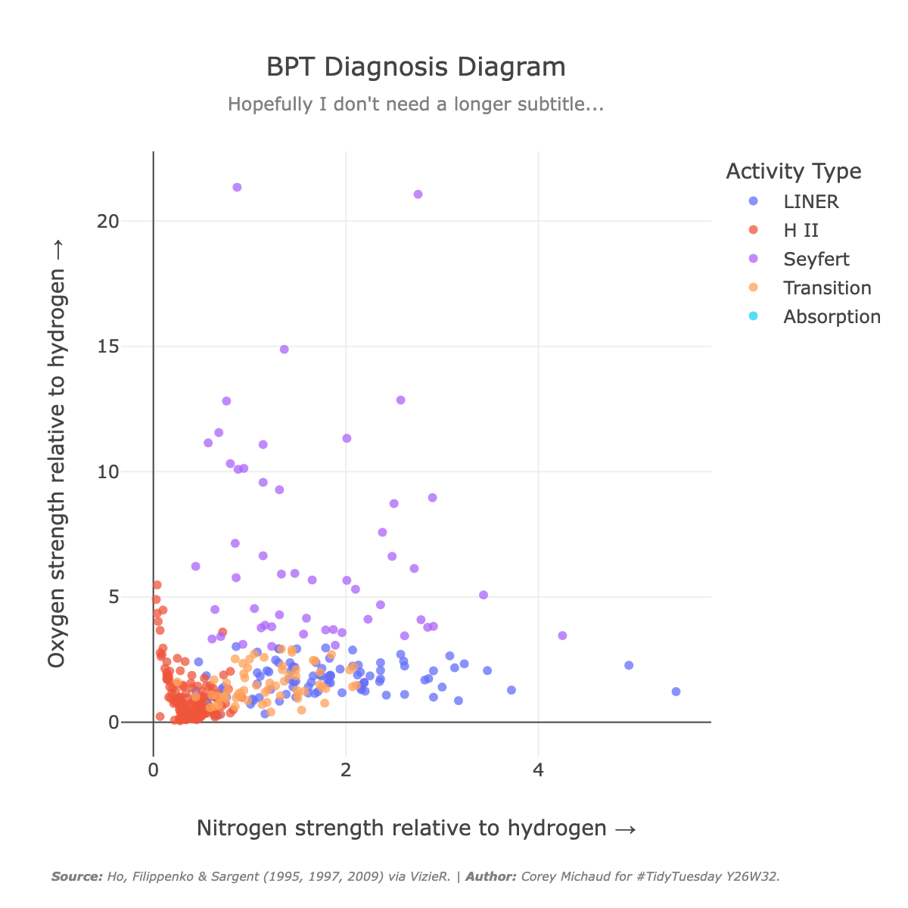

<!--
NOTES:
- corey!! if you post this on linkedin, maybe also add a link to that post?
-->

# My TidyTuesday Visualizations

This repository is to store my work for the [TidyTuesday](https://github.com/rfordatascience/tidytuesday) weekly challenge.

If you're wondering "what is a TidyTuesday??", TidyTuesday is a social data project organized by the [Data Science Learning Community](https://dslc.io/), where each week a dataset is given for enthusiasts to analyze, visualize, and post online.

You can easily find these posts by searching on most social platforms for the hashtags `#TidyTuesday` or `#PydyTuesday`. It's nice to see how others interpreted the same data you were looking at!

If you want to quickly see my work, check out the [Weekly Visualizations](#weekly-visualizations) section.

## Structure

If you want to check out any of the code, I've structured this repo as follows:

```
tidytuesday/
└── year/
    └── week-#/
        ├── eda.ipynb       # exploratory data analysis, rendered as a notebook
        ├── app.py          # streamlit dashboard (if no single visualization)
        ├── viztitle.ipynb  # final visualization, rendered a a notebook (if no dashboard)
        ├── viztitle.png    # image of dashboard or single visualization
        └── README.md       # week-specific information, process, links, image of viz, ...
```
# Weekly Visualizations

For all the following visualizations, if you click on the:

- **Title Y#W#:** it will take you to that week's folder within this repo.
- **Image:** it will take you to the hosted dashboard, *OR* it will take you to the `README.md` for that week if it's a single, unhosted graph.

## [Y26W32:]() BPT Diagnosis Diagram

[](2026/week-32/README.md)
